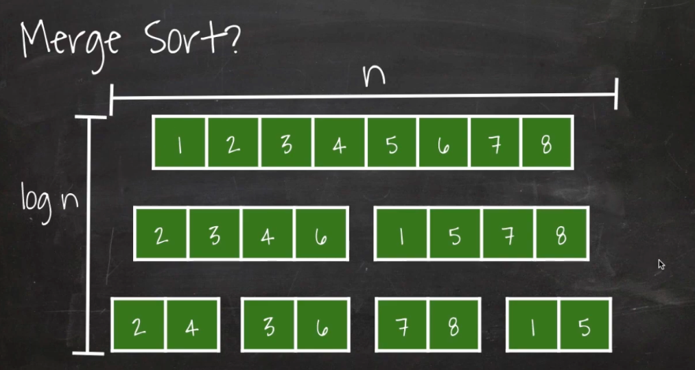

# 병합정렬(Merge Sort)

- 요소 목록을 정렬하는 알고리즘
- 목록을 재귀적으로 두 개로 나누어 각 부분 요소를 개별적으로 정렬한 다음, 두 개의 부분 요소를 정렬된 목록으로 병합하는 방식으로 작동
- 시간 복잡도: O(NlogN)
- 정렬하는 과정에서 별도의 메모리 공간이 필요하다.

## 알고리즘 과정
1. 요소를 두 개의 부분 요소로 나눈다.
2. 각 부분 요소를 재귀적으로 정렬한다.
3. 정렬된 두 요소를 병합한다.
   1. 각 부분 요소의 첫 번째 요소부터 비교한다.
   2. 더 작은 값을 추가하고 추가된 부분 요소는 그 다음 요소를 다른 부분 요소와 비교한다.
   3. 이를 두 부분 요소에 남는 요소가 없을 때 까지 반복한다.

## 사용되는 곳
- 대규모 데이터 집합 정렬
  - 병합 정렬은 시간 복잡도가 O(n 로그 n)이므로 대규모 데이터 세트에 효율적인 정렬 알고리즘입니다. 일반적으로 파일이나 데이터베이스 정렬과 같은 데이터 처리 애플리케이션에서 사용됩니다.

- 외부 정렬
  - 병합 정렬은 주 메모리에 넣기에는 너무 큰 데이터 집합을 정렬하는 외부 정렬에 자주 사용됩니다. 
  병합 정렬은 메모리에 들어갈 수 있는 작은 데이터 청크를 정렬하는 데 사용되며, 
  정렬된 청크가 병합되어 최종 정렬된 출력을 생성합니다.

- 병렬 처리:
  - 병합 정렬은 독립적으로 해결할 수 있는 작은 하위 문제로 쉽게 나눈 다음 다시 병합할 수 있기 때문에 병렬 처리에 적합합니다. 
  따라서 병합 정렬은 분산 컴퓨팅 또는 멀티코어 프로세서와 같은 병렬 컴퓨팅 애플리케이션에 널리 사용됩니다.

## 출처
- [엔지니어대한민국 유튜브](https://www.youtube.com/watch?v=7BDzle2n47c)
