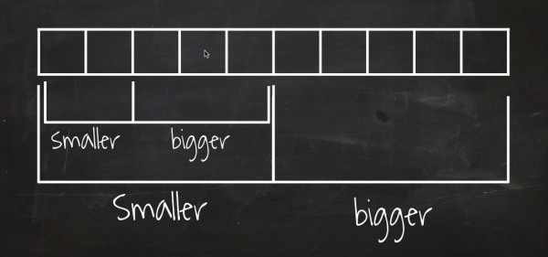
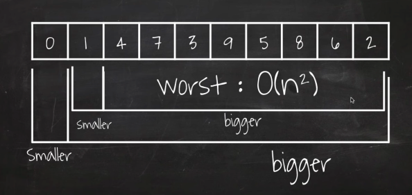

# 퀵 정렬
- 분할 및 정복 방식을 사용하여 항목 목록을 정렬하는 효율적인 정렬 알고리즘
- 알고리즘 과정
    - 원소 중 피벗 요소를 선택한다.
    - 피벗을 중심으로 목록을 분할하여 작은 요소는 모두 한쪽에 큰 요소는 다른 쪽에 배치한다.
    - 전체 목록이 정렬될 때까지 파티션에 의해 생성된 하위 배열에 quicksort를 재귀적으로 적용
- 퀵 정렬의 효율성은 피벗 요소의 선택에 따라 크게 달라져 최악의 경우 O(N^2)의 시간복잡도를 가진다.
- 일반적으론 O(NlogN)의 시간복잡도를 가진다.
- 좋은 피벗을 선택하기 위한 전략
    - 목록의 중앙값을 선택(계산 비용이 많이 들 수 있다.)
    - 임의의 요소를 피벗으로 선택

- 최악의 경우

## 출처
- [엔지니어대한민국 유튜브](https://www.youtube.com/watch?v=7BDzle2n47c)
