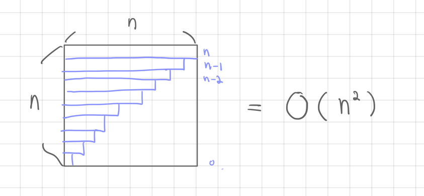

# 선택 정렬(Selection Sort)

- 정렬되지 않은 부분에서 제일 작은 요소를 반복적으로 찾아 배열의 시작 부분으로 이동하는 간단한 알고리즘
- 시간 복잡도는 O(N^2)
- 가장 효율적인 정렬 알고리즘은 아니지만 이해하고 구현하기 쉽다.

## 알고리즘 과정
1. 정렬되지 않은 원소 중 작은 값을 찾는다.
2. 작은 값과 정렬되지 않은 원소 중 첫 번째 원소와 위치를 바꾼다.
3. 마지막 원소까지 1~2번을 반복한다.

## 사용되는 곳
- 시간 복잡도로 인해 실제 사용이 제한되어 대규모 데이터 집합에는 비효율적이다.
- 데이터 집합이 작거나 배열이 이미 부분적으로 정렬되어 있는 특정 시나리오에서는 유용하게 사용할 수 있다.
- 부분 정렬된 배열: 배열이 이미 부분적으로 정렬된 경우, 선택 정렬은 정렬 프로세스를 완료하는 데 O(n) 번의 스왑만 필요하므로 좋은 선택이 될 수 있다.
- 임베디드 시스템: 선택 정렬은 사용 가능한 메모리가 제한되어 있고 처리 능력이 낮은 임베디드 시스템이나 기타 리소스 제약이 있는 환경에서 유용할 수 있다.
- 전반적으로 단순성과 구현 용이성이 더 중요한 특정 상황에서는 유용한 도구가 될 수 있다.

> Big-O 표기법

- n -> n-1 -> n-2 ... -> 0 도 하나의 n으로 보기 때문에 옆과 같은 순회도 O(n)으로 본다.

## 출처
- [엔지니어대한민국 유튜브](https://www.youtube.com/watch?v=7BDzle2n47c)
